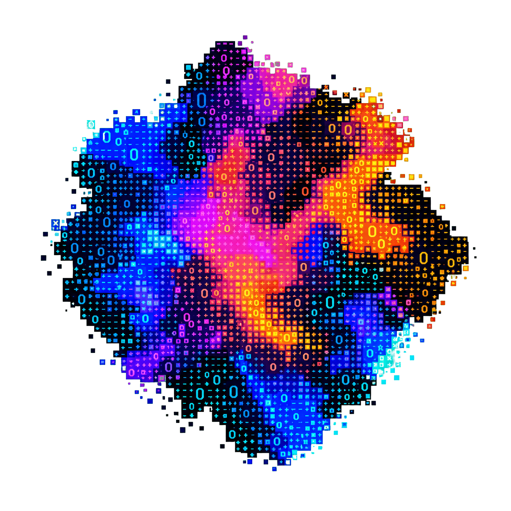

<section class="cyberful-hero">
  

    
Application-security workbench

    <h1>Find what breaks before someone else does.</h1>
    

      Guide an AI coding agent through authorized penetration tests, code
      audits, and bug bounty programs—from a precise scope to findings an
      independent verifier can reproduce.
    

    

      <a class="md-button md-button--primary" href="getting-started/">Run your first test</a>
      <a class="md-button" href="user-guide/workflows/">Explore workflows</a>
    

    

      Open source
      Local-first
      Zero telemetry
    

  

  <figure class="cyberful-cli-visual">
    
  </figure>
</section>

<section class="cyberful-home-section">
  

    

      Workflows
      <h2>Choose the work. Keep the evidence standard.</h2>
    

    
Each workflow has its own scope and safety contract. Every one ends with independently verified findings.

  

  

    <a class="cyberful-workflow-card" href="user-guide/workflows/#pentest">
      01 / Live target
      <h3>Pentest</h3>
      
Move from an explicit brief through recon and exploitation to a report backed by reproducible evidence.

      brief → recon → exploit → verify → report
    </a>
    <a class="cyberful-workflow-card" href="user-guide/workflows/#bug-bounty-program">
      02 / Program scope
      <h3>Bug bounty</h3>
      
Translate official program rules into a bounded engagement and a submission another researcher can reproduce.

      program → test → evidence → submission
    </a>
    <a class="cyberful-workflow-card" href="user-guide/workflows/#code-audit">
      03 / Source review
      <h3>Code audit</h3>
      
Trace attack paths without writing to the checkout, using a disposable isolated lab only when verification needs it.

      scope → trace → attack → verify → report
    </a>
  

</section>

<section class="cyberful-workflow">
  

    

      Execution model
      <h2>One disciplined path from scope to report</h2>
    

    <a href="concepts/execution-model/">See how isolation works →</a>
  

  

    
01Brief

    
02Recon

    
03Exploit

    
04Hacker

    
05Verify

    
06Report

  

</section>

<section class="cyberful-home-section">
  

    

      Get started
      <h2>From zero to a scoped run</h2>
    

    
Three short steps. No internal architecture knowledge required.

  

  

    <a class="cyberful-card" href="getting-started/requirements/">
      01↗
      <h3>Check the requirements</h3>
      
Prepare Docker, disk space, and one supported agent provider.

    </a>
    <a class="cyberful-card" href="getting-started/install/">
      02↗
      <h3>Install Cyberful</h3>
      
Install the CLI globally, then confirm the local runtime is ready.

    </a>
    <a class="cyberful-card" href="getting-started/">
      03↗
      <h3>Run an authorized test</h3>
      
Define exact targets and constraints, then follow the phase-by-phase run.

    </a>
  

</section>

  !
  
<strong>Authorization is part of the system boundary.</strong> Use Cyberful only on systems you own or are explicitly authorized to test. Workareas, evidence, reports, browser profiles, and scanner state may contain sensitive data and must not be committed.

<section class="cyberful-home-section cyberful-home-section--deep">
  

    

      Documentation
      <h2>Go deeper</h2>
    

  

  

    <a href="user-guide/workflows/"><strong>Use Cyberful</strong>Terminal, sessions, evidence, reports, and providers.<i aria-hidden="true">→</i></a>
    <a href="concepts/architecture/"><strong>Understand the system</strong>Phases, isolation, handoffs, and safety boundaries.<i aria-hidden="true">→</i></a>
    <a href="runtimes/"><strong>Operate security tools</strong>Browser, OWASP ZAP, Ghidra, cyberful-os, and EVM.<i aria-hidden="true">→</i></a>
    <a href="development/"><strong>Build with us</strong>Contributor workflows, testing, and releases.<i aria-hidden="true">→</i></a>
  

</section>
