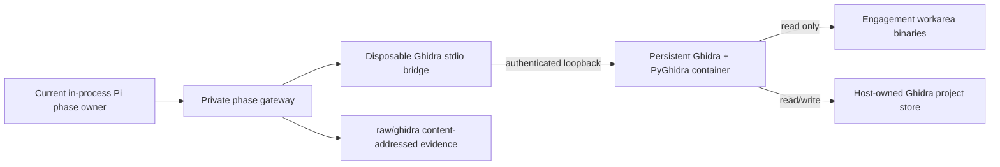

# Ghidra

Cyberful runs Ghidra 12.1.2 as a headless, Dockerized, engagement-scoped
reverse-engineering service. The image is built from the official NSA release
archive and verifies its published SHA-256 before installation. PyGhidra starts
one JVM and opens one durable `Cyberful` project; no Ghidra desktop or web GUI is
involved.

## Supported hosts

The Ghidra service image is deliberately `linux/amd64`. The official Ghidra
archive ships its Linux decompiler for `x86_64`, but not for Linux ARM64.

| Host | Support |
| --- | --- |
| Linux `x86_64` | Native Docker execution |
| macOS Intel | Docker Desktop Linux VM |
| macOS Apple Silicon | Docker Desktop `linux/amd64` emulation; slower than native |

The complete persistence contract is exercised on macOS Apple Silicon. Keep
Docker Desktop's Linux-container emulation enabled there. This runtime does not
claim Windows support.

## Runtime shape



The Ghidra container starts once before the workflow chain and remains alive
across sequential phase handoffs. Each eligible phase gets a fresh bridge
container in the runtime's network namespace. The service binds only to
container loopback, publishes no host port, and has no target network.

At engagement completion or a handled `Ctrl+C`, Cyberful removes the service
and every related bridge. Worker shutdown, the TUI's run-label sweep, and a
bounded synchronous process-exit retry provide layered cleanup. An
unhandleable `SIGKILL`, host crash, or unavailable Docker daemon cannot carry
the same guarantee and leaves a warning when cleanup can still report.

Cyberful deliberately retains the host-owned project store because it is a
separate bind mount, not a container volume. Starting a later runtime for the
same canonical workarea reopens that store, including analysis databases,
user-defined names, comments, bookmarks, import metadata, and the job journal.

## MCP tools

The gateway exposes a small first-party surface:

| Tool | Purpose |
| --- | --- |
| `ghidra_project` | Project status, program inventory, and durable checkpoint |
| `ghidra_import` | SHA-256-idempotent workarea import with optional analysis |
| `ghidra_job` | Submit analysis and list, inspect, or cancel persistent jobs |
| `ghidra_search` | Paginated function, symbol, and defined-string search |
| `ghidra_listing` | Bounded disassembly by function or address |
| `ghidra_decompile` | Bounded decompilation by function or address |
| `ghidra_xrefs` | Paginated incoming or outgoing references |
| `ghidra_call_graph` | Bounded directed call graph with optional root and depth |
| `ghidra_annotations` | List or add comments, bookmarks, and function renames |

Cyberful does not expose arbitrary GhidraScript execution, binary patching,
debugger control, or a generic Java/Python evaluation tool. The cyberful-os
`analyze_headless` command remains available as a low-level CLI, but the
persistent MCP is the primary semantic reverse-engineering interface.

## Asynchronous analysis

Imports and full analysis run as persistent jobs. `ghidra_import` returns a job
identifier immediately; use `ghidra_job` with `action=status` until it reaches a
terminal state. Ghidra's headless APIs are not thread-safe, so one worker
serializes all JVM operations. Interactive queries return a visible busy error
instead of waiting behind a long analysis and exhausting the gateway's call
deadline.

Every job transition is appended to `jobs.jsonl`. If the container exits with a
job queued or running, the next instance requeues it. Imports are keyed by the
source SHA-256, so replay cannot create a duplicate program.

## Persistence and evidence

The authoritative store lives below Cyberful's application data root:

```text
ghidra-store/<sha256-of-canonical-workarea>/
  project/              Ghidra .gpr/.rep project
  manifest.json         imported program identity and analysis state
  jobs.jsonl            append-only job transitions
  annotations.jsonl     append-only annotation audit
  checkpoint.json       latest explicit checkpoint
  home/                 isolated Ghidra preferences
```

That directory is mode `0700`, is physically separate from the model-writable
workarea, and is mounted only into the persistent service. The workarea is
mounted read-only.

The phase gateway records each redacted Ghidra result as a content-addressed
object under `raw/ghidra/objects/` and maintains `raw/ghidra/index.json`.
Reports can therefore cite portable evidence without copying the mutable Ghidra
database into the workarea.

## Phase policy

The runtime persists for the whole engagement, but the live MCP surface is
limited to analysis phases:

| Workflow | Ghidra-enabled phases |
| --- | --- |
| Pentest | Recon, Exploit, Hacker, Verify |
| Bug Bounty Program | Recon, Exploit, Hacker, Verify |
| Code Audit | Index, Trace, Hunt, Attack, Verify |

Brief/Scope and Report consume workarea evidence but cannot operate the live
project.

## Container hardening

The persistent container:

- runs as the invoking non-root host UID/GID;
- has a read-only root filesystem and a bounded temporary filesystem;
- drops every Linux capability and enables `no-new-privileges`;
- has no network, no published port, and finite CPU, memory, and PID limits;
- mounts only the read-only workarea and its one protected project store.

The bridge mounts neither filesystem. Its only secret is the engagement MCP
capability key, which stays in the gateway's owner-only private environment.

## Configuration

| Variable | Default | Meaning |
| --- | --- | --- |
| `CYBER_GHIDRA_ENABLED` | `1` | Set to `0` to disable the runtime and MCP |
| `CYBER_GHIDRA_IMAGE` | `cyberful-ghidra:12.1.2` | Persistent service image |
| `CYBER_GHIDRA_BRIDGE_IMAGE` | `cyberful-ghidra-bridge:0.1.0` | Phase bridge image |
| `CYBER_GHIDRA_STARTUP_TIMEOUT_SECONDS` | `300` | JVM/project readiness deadline |
| `CYBER_GHIDRA_DIR` | bundled `mcps/ghidra` | Optional build-context override |

`CYBER_GHIDRA_CONTAINER` and `CYBER_GHIDRA_MCP_KEY` are host-owned runtime
descriptors. Operators should not set or persist them.

## Build and test

```sh
make test-ghidra
```

This builds both images, runs Python boundary and protocol tests, compiles a real
fixture, imports and analyzes it, decompiles a function, builds a call graph,
adds an annotation, replaces the phase bridge, replaces the complete runtime,
and proves that the new instance reopens the same project and annotation.
