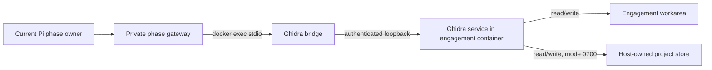

# Ghidra

Cyberful ships Kali's native Ghidra `12.1.2+ds-0kali1` and its bundled
PyGhidra wheels inside the unified cyberful-os image. Both `linux/amd64` and
`linux/arm64` manifests contain the matching native decompiler; Apple Silicon
does not use the former x86 emulation path.

The Kali base digest and pinned Ghidra package version form one update unit.
When that exact package is no longer available from the configured Kali
repository, update both values together and rerun the native amd64/arm64 suite;
do not silently relax the package pin.

## Runtime shape



The engagement container and Ghidra JVM persist across phase handoffs. A fresh
bridge process reconnects each eligible gateway; there is no bridge image,
bridge container, published Ghidra port, or separate Ghidra network namespace.

The host-owned store is a bind mount outside the model-writable workarea.
Recreating the engagement container reopens programs, analysis, names,
comments, bookmarks, import metadata, and the durable job journal. The
workarea is deliberately writable under the unified trust-boundary decision.

In Code Audit the whole engagement container starts with `--network none`.
Ghidra and its loopback bridge continue to work, while DNS and external traffic
fail. In live-target workflows Ghidra shares the cyberful-os container's
networking; phase MCP policy, mission scope, and instructions remain the
authority for tool exposure and traffic.

## MCP tools

| Tool | Purpose |
| --- | --- |
| `ghidra_project` | Project status, program inventory, and checkpoint |
| `ghidra_import` | SHA-256-idempotent workarea import with optional analysis |
| `ghidra_job` | Submit, list, inspect, or cancel persistent jobs |
| `ghidra_search` | Paginated function, symbol, and string search |
| `ghidra_listing` | Bounded disassembly |
| `ghidra_decompile` | Bounded native decompilation |
| `ghidra_xrefs` | Paginated incoming or outgoing references |
| `ghidra_call_graph` | Bounded directed call graph |
| `ghidra_annotations` | List or add names, comments, and bookmarks |

Arbitrary scripts, binary mutation, debugger control, and generic Java/Python
evaluation remain absent. One worker serializes JVM operations; imports and
analysis use durable asynchronous jobs.

## Phase policy

| Workflow | Ghidra-enabled phases |
| --- | --- |
| Pentest | Recon, Exploit, Hacker, Verify |
| Bug Bounty Program | Recon, Exploit, Hacker, Verify |
| Code Audit | Index, Trace, Hunt, Attack, Verify |

The gateway writes redacted, content-addressed evidence under `raw/ghidra/`.
Report phases consume that evidence without receiving a live Ghidra bridge.

## Failure and configuration

The supervisor runs Ghidra with the host UID/GID and records its state under
`/run/cyberful`. An unexpected JVM exit marks the unified container degraded
and is never restarted automatically. A new bridge then returns a diagnostic
service error rather than creating another runtime.

| Variable | Default | Meaning |
| --- | --- | --- |
| `CYBER_GHIDRA_ENABLED` | `1` | Disable with `0` |
| `CYBER_GHIDRA_STARTUP_TIMEOUT_SECONDS` | `300` | JVM/project readiness deadline |
| `CYBERFUL_OS_IMAGE` | release digest or local image | Unified image override |

Old `CYBER_GHIDRA_IMAGE`, `CYBER_GHIDRA_BRIDGE_IMAGE`,
`CYBER_GHIDRA_CONTAINER`, and `CYBER_GHIDRA_DIR` settings are rejected.

## Test

Build once, then run the focused contract:

```sh
make runtime-build
make test-ghidra
```

The native test compiles an ELF fixture on the runner, imports and analyzes it
with the real engine, finds and decompiles a function, creates call-graph and
annotation evidence, renews the `docker exec` bridge, recreates the unified
container, and proves that the `0700` project store persists.
